<link rel = "stylesheet" href = "style/intro.css">

<link rel = "stylesheet" href = "https://www.w3schools.com/w3css/4/w3.css">

<a href="https://greatdevelopers.github.io/ScriptCAD" class="w3-bar-item w3-button">Home</a>
<a href="https://goo.gl/forms/YeDk8IqOeDLKQOtB2" class="w3-bar-item w3-button">Register Here</a>

<button class="w3-button">Menu</button>

<a href="https://goo.gl/forms/YeDk8IqOeDLKQOtB2" class="w3-bar-item w3-button">Register Here</a>
<a href="https://greatdevelopers.github.io/ScriptCAD/Payment.html" class="w3-bar-item w3-button">Transaction Details</a>
<a href="https://greatdevelopers.github.io/ScriptCAD/FAQ.html" class="w3-bar-item w3-button">FAQs</a>
<a href="https://greatdevelopers.github.io/ScriptCAD/Terms.html" class="w3-bar-item w3-button">Terms & Conditions</a>

<button class="w3-button">Sessions</button>

<a href="https://greatdevelopers.github.io/ScriptCAD/Session0/Session0.html" class="w3-bar-item w3-button">Session-0</a>
<a href="https://greatdevelopers.github.io/ScriptCAD/Bishop_Tutorial.html" class="w3-bar-item w3-button">Session-1</a>

# Chess Bishop In FreeCAD (GUI only)

Before getting started, lets divide the Bishop in 3 basic parts.   
1. Head   
1. Lower part (neck and base)
1. collar and cut-out slot.

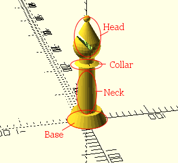

our bishop will be something what like this

## The Head:

* Open FreeCAD and select part workbench as there we can easily and
directly create our basic solids shapes that are required for our chess
bishop.

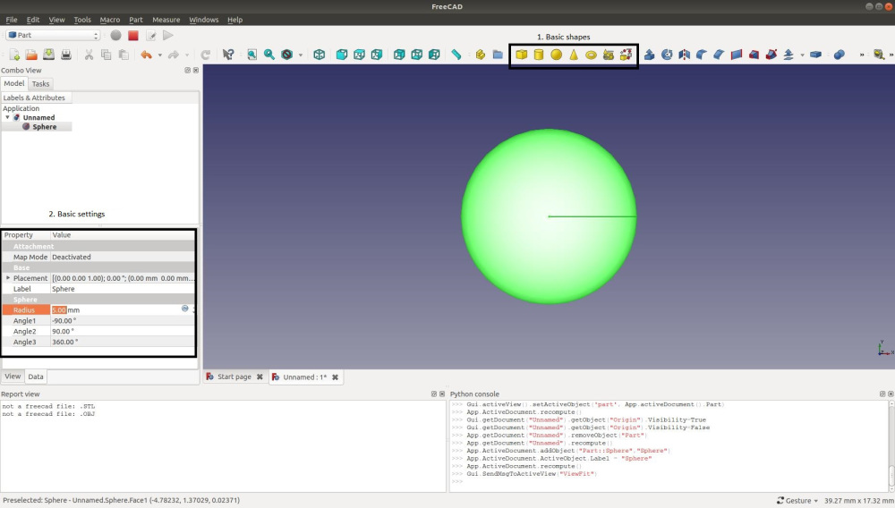

* From “1. Basic shapes” as the image we can create different shapes like
cube, sphere, cylinder, cone etc. From the “2. Basic settings” we can
change the dimensions and position/placement of the solid.

### Step 1: The sphere

* Click on to the sphere icon to create the sphere, now change the radius
of the sphere to 20, we are going to keep this sphere at the center itself.

### Step 2: The cone

* Now click on to the cone to create it. When you will do that you will see
that no cone was created, but it is actually there. Because of its small
dimensions it is hidden inside the sphere we made.

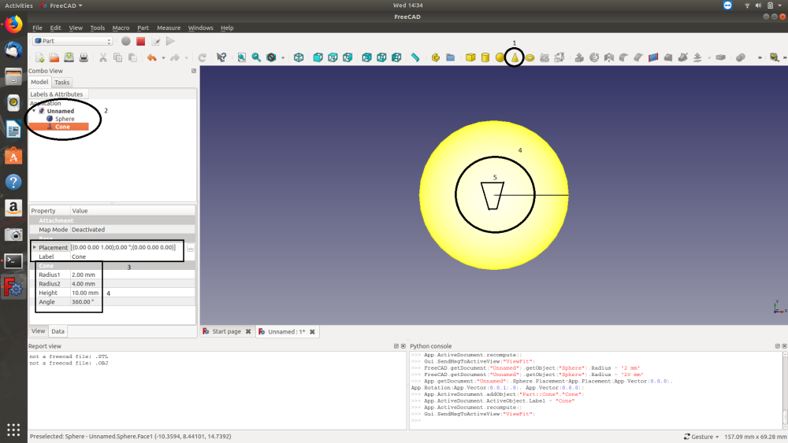

* From the image you may see that “2” shows that a cone is present. “4” is
the dimension of the cone, change it as we did in OpenSCAD. “5” is an
area where the cone or I may say frustum is there but hidden inside the
sphere.

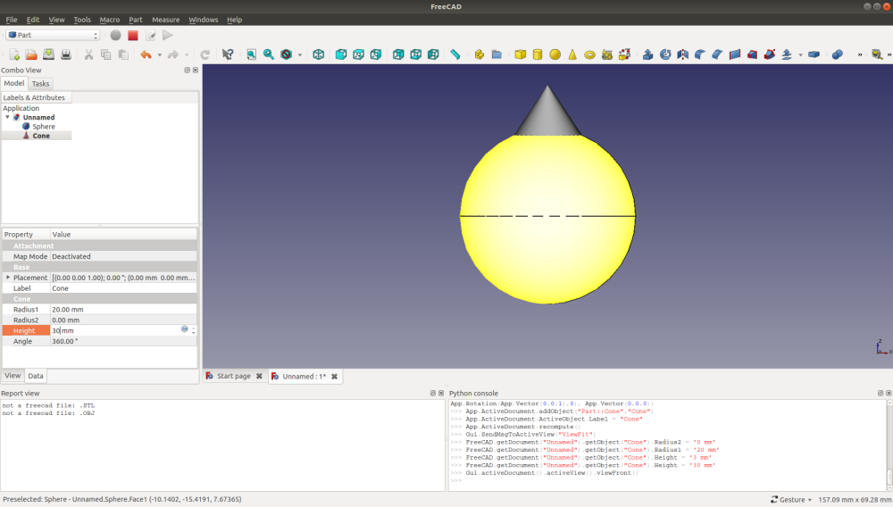

* After changing the dimensions accordingly we may see that the shape is
not at all like a water-drop, so as we did last time we will place the
bishop accordingly by clicking the placement.

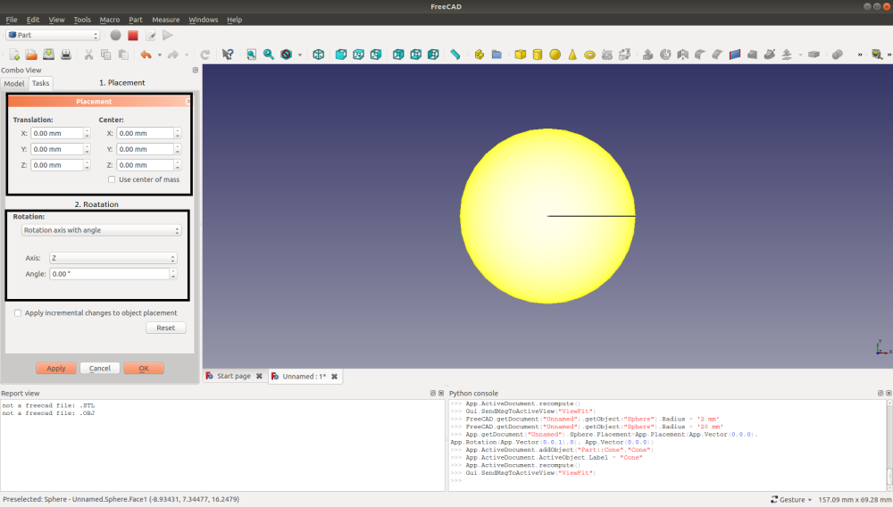

* After placing correctly the shape looks something what like the below
image.

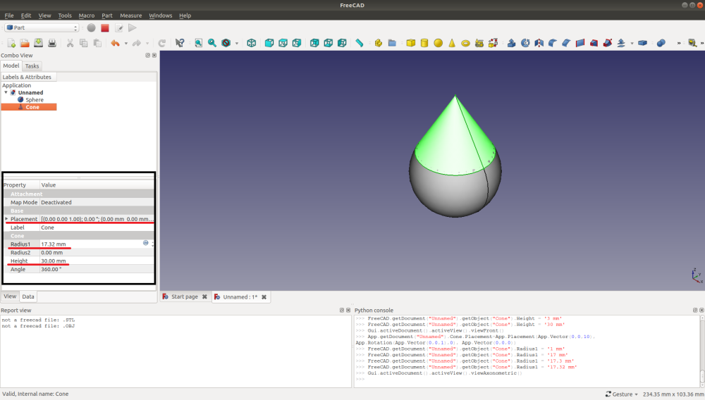

### Step 3: Union of solids

* Now it time to unite the two solids we created, the same thing we also
did in OpenSCAD right.

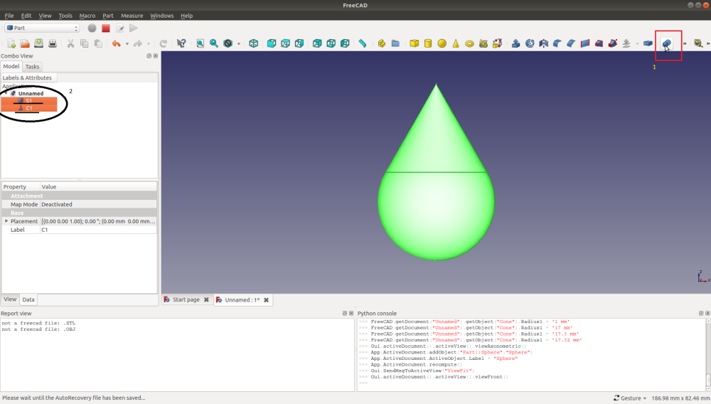

* In the image above from “1” we can perform ‘union’, ‘difference’ etc.

* Clicking to that it will as you to select the two solids. Select them
and click “Union” and then “Apply” and then “close”.

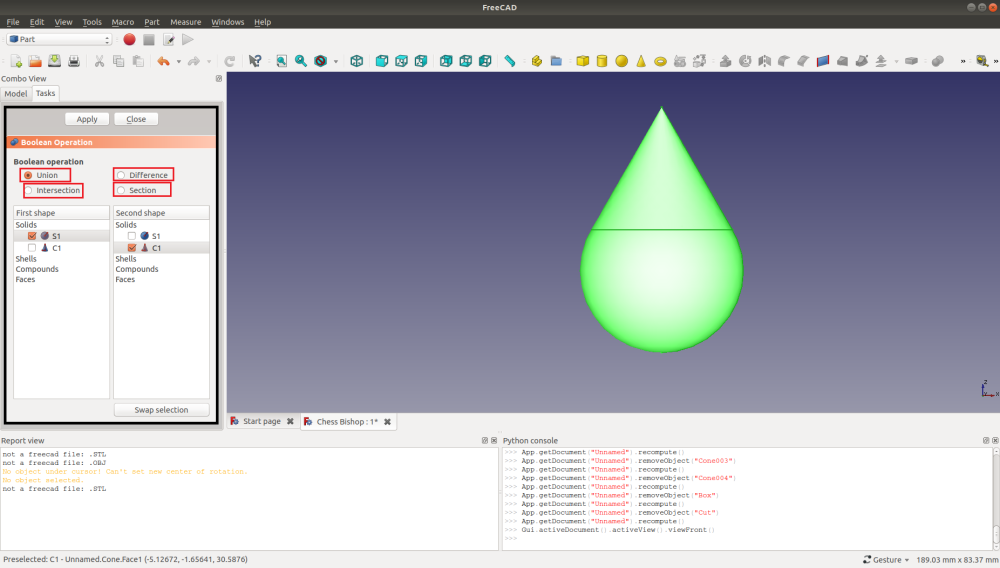

### Step 4: Dollop/Joker nose

* Now the procedure for other solids are also going to be same.

* Going to the Dollop shape or we can say Jokers nose shape.

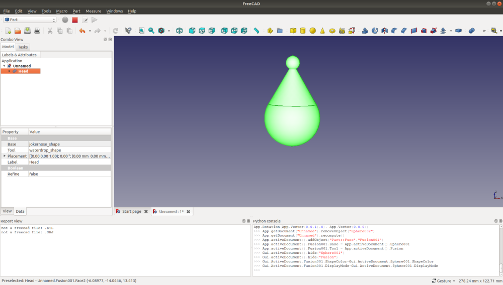

* Create a sphere, change its dimensions and placement accordingly.

* Then unite it with the water drop shape and we are done with the head
part.

## Neck And Base:

### Step 1:

* To create neck click on cone and change its radius1 and radius2 change
it’s height to create a frustum and place it correctly.

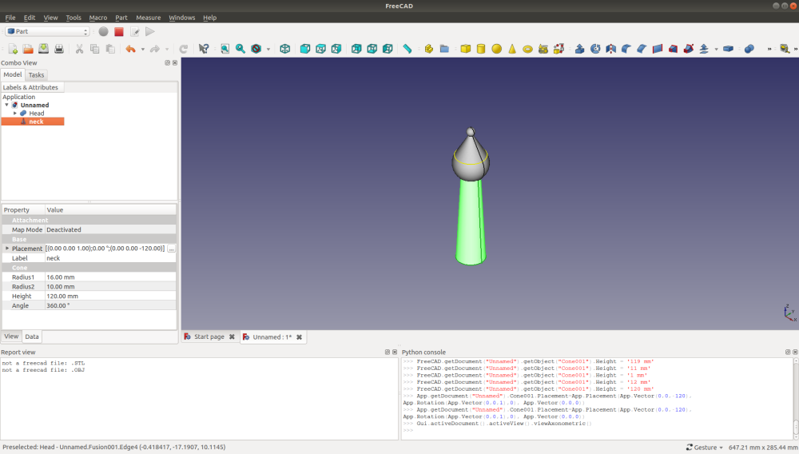

### Step 2:

* Click on cone again change its radius1 and radius2 also it’s height and
place it to the bottom and that will create the base.

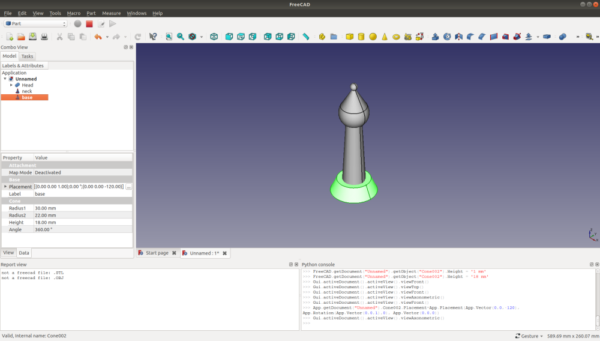

### Step 3:

Unite the neck and base.

Now it’s the turn for collar of the bishop.

## Collar:

* Creating the collar is simple just we have to do is to create a cone
change its radius1 and radius2 and place it little upper to its neck,
now create another cone do the same and rotate it by 180°, and unite the
two frustum.

* After doing this unite “collar” and “neck-base”.

* Also unite the head and lower part to create the “raw bishop”

* The collar is also done. Now it’s time for the final step i.e. the cut
out slot

## Cut out slot:

### Step 1:

* To do that create a cube change its height and length accordingly and
also it’s width. Place it accordingly and also rotate it 45°.

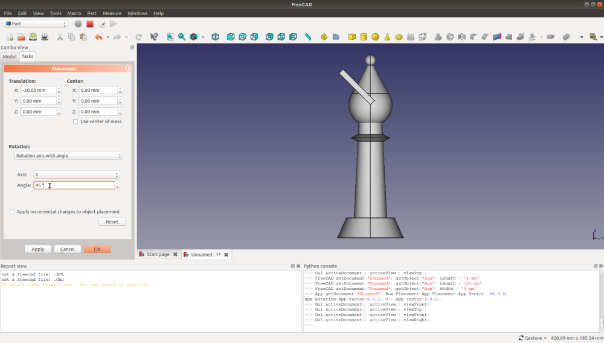

* Which will look something what like the above image.

### Step 2:

* Now we have to cut the cuboid from the raw bishop that we had created.

* For that the procedure is same as Union just we have to click the
difference Boolean operation.

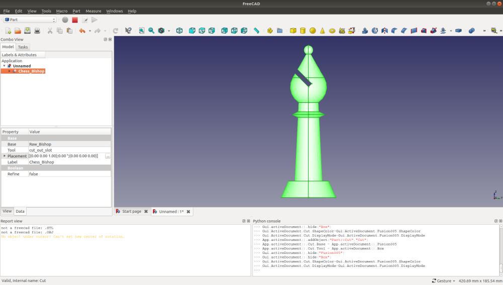

* Which will look something what like this.

* Now we are done with the bishop and it just took 30-35 minutes to make
it. Isn’t it simple to make complex shapes using basic and simple
shapes?

* Our final Chess bishop will look like this

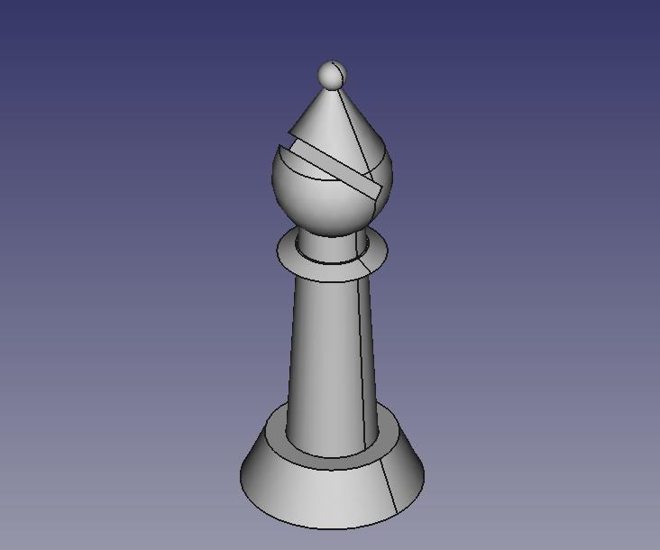

Hope you enjoyed it.

Thank you!

Follow the blog for Chess_Bishop

https://akmecha.wordpress.com/2018/09/15/chess-bishop-in-freecad/

